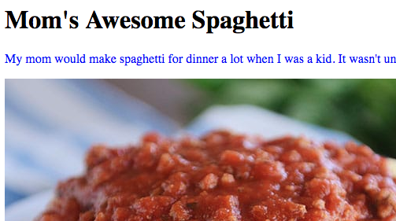
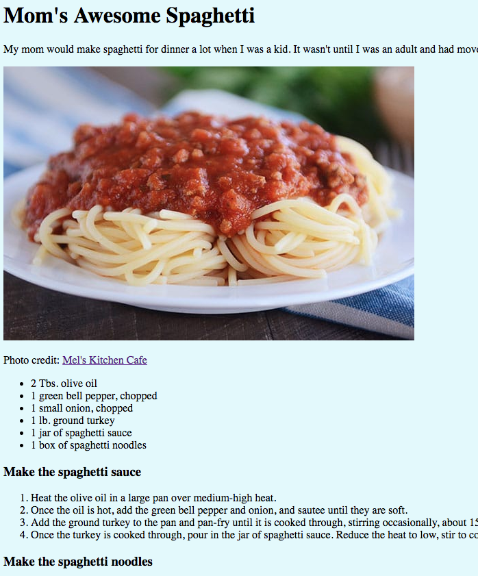
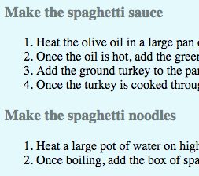
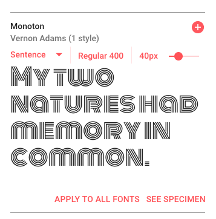
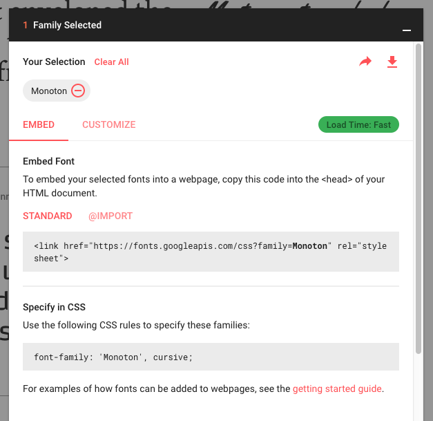
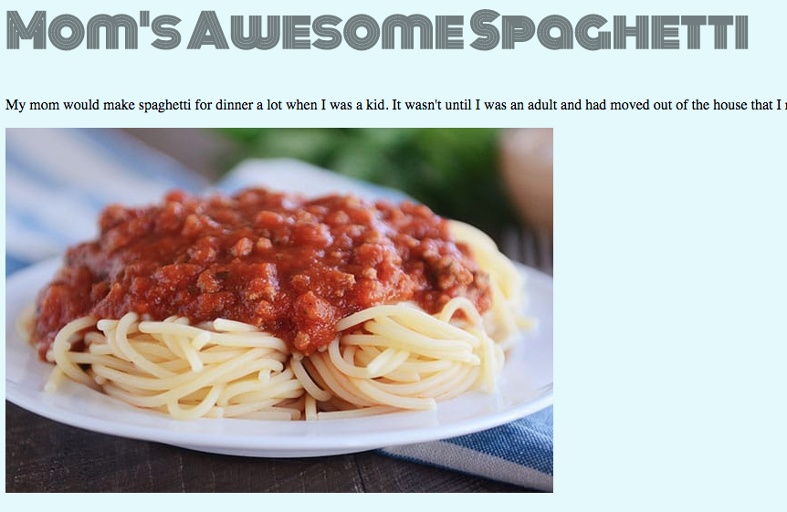
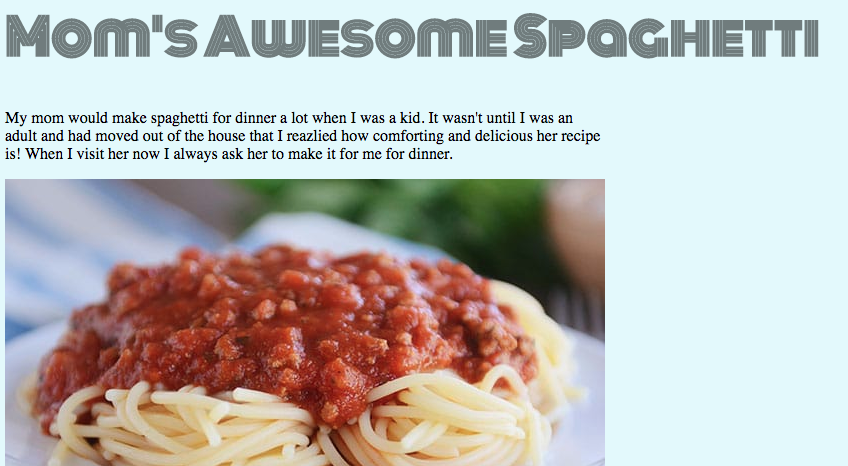
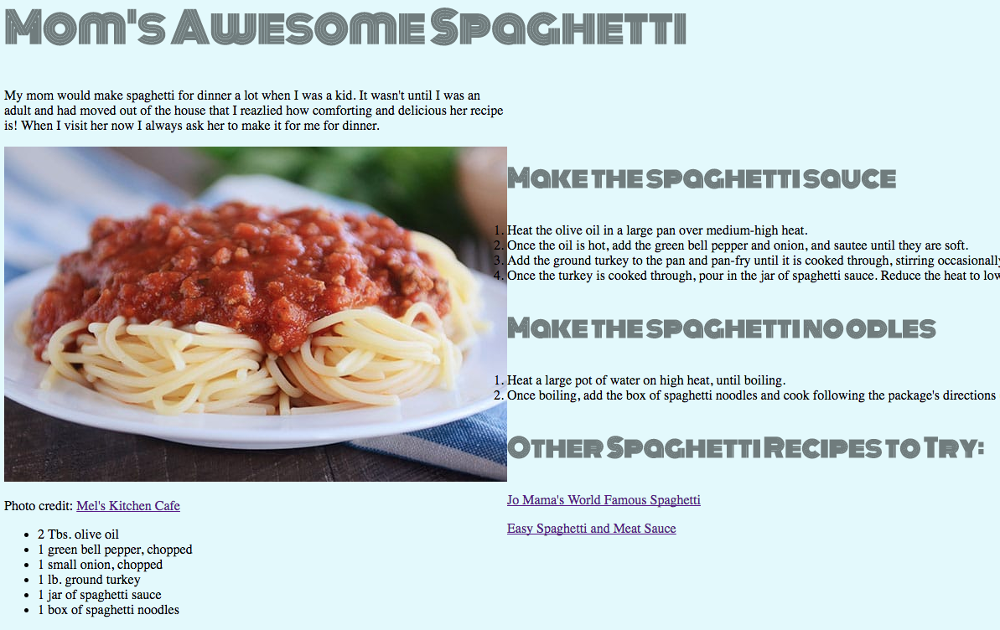
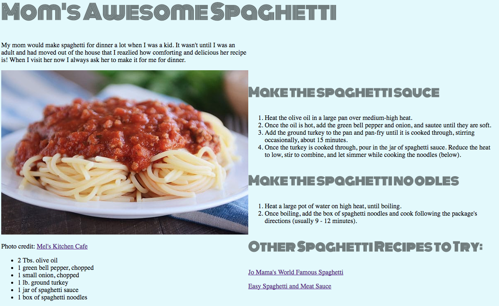
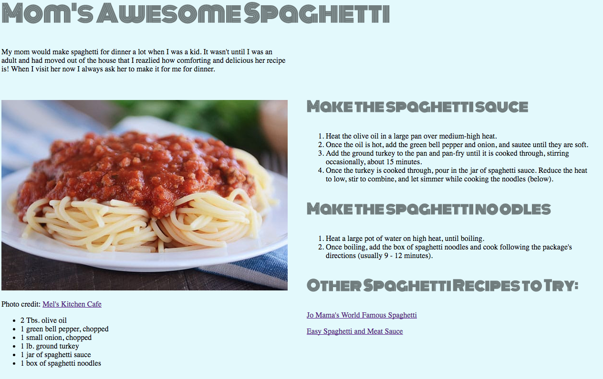

# Project 1 - Recipe Page

### Phase 2 - Add styling with CSS

### Languages

- HTML
- CSS

### Frameworks

None

### Primary Goals

1. Learning to style HTML using CSS
2. Receiving and incorporating constructive feedback on a project

### Overview

In this project, you will create a well-designed webpage that displays one of your favorite recipes. It will include the ingredients, the steps needed to make the dish, links to similar recipes, and at least one photo.

Phase 1 of the project involves coding the structure of your webpage using HTML. This includes the ingredients, the steps needed to make the dish, links to similar recipes, and at least one photo.

Phase 2 of the project involves adding styling and pizazz using CSS. This includes changing the font style, font size, colors, and significantly altering the layout.

Phase 3 of the project involves incorporating JS DOM methods. You'll add at least three interactive elements of your choosing (next week).

Note: There used to be a "Bootstrap" part of this project, but Bootstrap is no longer a part of the Difmo curriculum. If you'd like to research and incorporate a library to streamline the CSS process, you can do that on your own.

### Context

- You completed a basic HTML page in Phase 1
- You learned basic CSS syntax and rules in the intro lesson
- Let's style your HTML with CSS!

### Basic Requirements

1. Create a file tree for your Recipe Page project
2. Create a CSS file in the proper directory of your file tree
3. Link to your CSS file from within your HTML `<head>` tags
4. Change the background color of your webpage
5. Change the font and font color of your headings and paragraphs
6. Constrain the description to the width of the image
7. Make the image and ingredients appear on the left
8. Make the instructions appear on the right

## Lab Instructions

If you have questions, do not disturb your colleagues until you have spent at least 20 minutes troubleshooting on your own. Be sure to format your question using the template we practiced in the [Asking Good Questions](../../onboarding/asking-good-questions.md) lesson.

### Starter Code

You'll be building on the HTML code you completed in Phase 1 of this project.

Try to build in your local desktop file this time, since CodePen won't help you understand how the HTML and CSS are connected. Remember that you'll need to save (`command + s` on Mac) and refresh your browser page to see new CSS changes.

### Lab Exercise

#### Part 1 - Create a CSS file in the proper directory of your file tree

Note: If you are using an online editor such as Replit or Codepen please ignore this part for now

1. On your desktop, create a folder called `Difmo-projects`. Inside that, create a folder called `recipe-page`. Move your `recipe-page.html` file into `Difmo-projects/recipe-page`. If you no longer have `recipe-page.html`, make it again with the Challenge directions from [Phase 1](./phase-1-html-prompt.md#challenge).
2. Use TextEdit or WordPad to make a new file called `styles.css`. Make sure it is in the `Difmo-projects/recipe-page` directory right next to `recipe-page.html`.
3. Now that it's in `Difmo-projects/recipe-page`, it's obvious what your HTML file is for. Rename `recipe-page.html` to `index.html`.

#### Part 2 - Link to your CSS file from within your HTML `<head>` tags

1. In `styles.css`, add this small bit of CSS code to the file, then save the file.

```css
p {
  color: blue;
}
```

We're doing this so we can easily see if we've successfully connected `styles.css` to `index.html`. We'll know it worked if all of our paragraph text appears blue instead of the default black when we load `index.html` at the end of this step.

2. Now we need to link to `styles.css` from within `index.html`. Open `index.html`. Read the following code snippet and make sure you understand what it does. Then, copy and paste it into the `<head>` area of `index.html`, just below the `<meta>` tag.

```html
<link rel="stylesheet" type="text/css" href="styles.css" />
```

**Questions to Consider**

- What are `rel`, `type`, and `href` called?
- What are `"stylesheet"`, `"text/css"`, and `"styles.css"` called?

Open `index.html` in Chrome. The blurb under your title should be blue!



When you're satisfied that `styles.css` is properly linked to `index.html`, run `git status`. Add and commit, making sure to write a descriptive commit message in the present tense, such as "Links stylesheet to index."

#### Part 4 - Change the background color of your webpage

If you want to change your paragraph text back to black from the temporary blue, do so now by simply deleting all the code in `styles.css`.

Now, write some CSS code in `styles.css` that will change the background color to any color you like!

- You can use [this color picker](http://htmlcolorcodes.com/color-picker/) to find the right hexadecimal color code.
- Or you can use _Digital Color Meter_, an app that ships with MacOS that can tell you the color of anything showing on your screen. Hit `cmd + spacebar` to bring up your Spotlight window, and begin to type `color`. After you select and launch Digital Color Meter, you'll see a small window that "picks" the pixel your mouse is currently hovering over. There is no dropdown option to show the color values in hexadecimal, so you'll have to use a piece of scratch paper, write down the RGB values, and use an online converter to get the hex code (Google provides one if you search for `rgb to hex`).
- Keep in mind that readability is really important. It's very hard for most people to read screens that have really bright backgrounds (yellow, orange, red, pink) or really dark backgrounds (black, brown, navy).

Refresh `index.html` in Chrome by pressing `<COMMAND> + r`. Does your new background color show up?



When you're happy with the background color, run `git status`. Add and commit, making sure to write a descriptive commit message in the present tense, such as "Changes background color."

#### Part 5 - Change the font and font color of your headings and paragraphs

1. Select all the headings by writing CSS code inside `styles.css` and change the color to something that works well with your background color.

- Hint 1: Can you figure out how to use multiple selectors for the same style change, rather than writing code for each one separately?
- Hint 2: Use the drop-down menu on the color picker website to easily find contrasting and complementary colors.


Refresh `index.html` in Chrome by pressing `<COMMAND> + r` to see if it worked!



When you're happy with the new font color, run `git status`. Add and commit, making sure to write a descriptive commit message in the present tense, such as "Changes font color."

2. Find a [Google font](https://fonts.google.com/) that you think works well with your color scheme, recipe, and the overall vibe you want to create on your webpage.



When you find a font you want to use, click the orange plus sign in the upper right-hand corner. A black strip will appear at the bottom of your browser.


Click on it to expand it. You'll now see a pane that contains some HTML code and some CSS code. Copy and paste these code snippets into the proper files in order to include this new font in your project.



Refresh `index.html` in Chrome by pressing `<COMMAND> + r` to see if it worked.



If you need to make the font size larger or smaller for your headings due to the new font's default size, go ahead and make these changes now in `styles.css`.

When you're happy with the new font, run `git status`. Add and commit, making sure to write a descriptive commit message in the present tense, such as "Links to Google font for headers."

#### Part 6 - Make the description the same width as the image

You may remember from Phase 1 of the project that we constrained the width of the image to 600px. (If you haven't done this yet for some reason, please do so now.) Let's now also constrain the blurb text underneath the title to a width of 600px, to make it easier for the user to read.

The description is currently inside a pair of `<p>` tags. But if we use the `<p>` element as a selector, any paragraph text we add later will also be affected by the 600px constraint. A better way to select the description is to give its opening `<p>` a class called "description" and then use `.description` as a selector in `styles.css`. Go ahead and do this, implementing the width constraint to 600px on your own.

Refresh `index.html` in Chrome by pressing `<COMMAND> + r`. Did it work?



When you've successfully constrained the width of the description to match the width of the image, run `git status`. Add and commit, making sure to write a descriptive commit message in the present tense, such as "Constrains description width to 600px."

#### Part 7 - Make the image and ingredients appear on the left

Right now, the entire webpage is displayed in a vertical fashion. We can make all the content appear on the screen, side by side, and eliminate the need for a user to have to scroll to read everything.

We've already accomplished some initial steps for making this happen. We have the title and description in their own `<div>` which has a class called `top`. If we don't specify any layout styling for this div in `styles.css`, it just defaults to taking up the whole width of the screen. This is what we want, based on the layout image [shown in the instructions](./phase-1-html-prompt.md#part-9---add-some-divs-for-easy-css-integration-later).

We've also created divs that have a class called `left` and `right`, respectively. Can you guess what we're going to use those classes for? We're going to use them as CSS selectors!

1. In `styles.css`, use the `left` class as a selector. We want to constrain the width of this div to 600px so that it aligns perfectly with the image above it. Implement that now. We also want it to float on the left. Implement that now, too.

Refresh `index.html` in Chrome by pressing `<COMMAND> + r`. Do you see a change to your layout?

You should see that while the div with the `left` class has stayed on the left, the div with the `right` class is now on the right and overlapping some of the content. Progress! Let's fix that silly overlap in the next step.



When you've successfully made the `<div>` with the `.left` class float on the left of the webpage, run `git status`. Add and commit, making sure to write a descriptive commit message in the present tense, such as "Float half the content on the left."

#### Part 8 - Make the instructions appear on the right

1. In `styles.css`, use the `right` class as a selector. We want to constrain the width of this div to 600px so that it matches the width of the image and the left div. Implement that now. We also want it to float on the left of its allotted space. Implement that now, too.

Refresh `index.html` in Chrome by pressing `<COMMAND> + r`. Do you see a change to your layout?

No more overlap!



Play around with the float position of the `right` class. What happens when you use `float: center;` and `float: right;`? Why do you think this happens? Reset back to `float: left;` when you're done.

2. Let's add a little bit of blank space between the two divs. Using the `margin-left` property, add at least 30px of space onto the `right` div.

3. If the top of your image is not aligned with the top of your instructions, add a `margin-top` property to the `left` div so they match.



Voila!

When you're happy with the layout of your webpage, run `git status`. Add and commit, making sure to write a descriptive commit message in the present tense, such as "Completes styling and layout."

---

### Questions to Consider

- What, if anything, was challenging about this phase of the project?
- What did you enjoy the most while working on this phase of the project?
- What questions came to mind as you were working through the steps?
- If you were to explain to a bright child what you worked on during the phase, what would you tell them?

### Frequently Asked Questions

- We can add common FAQs here. Open a GitHub issue or PR if you have any questions.
